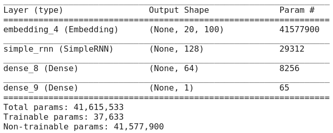
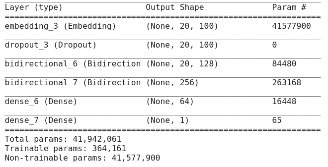
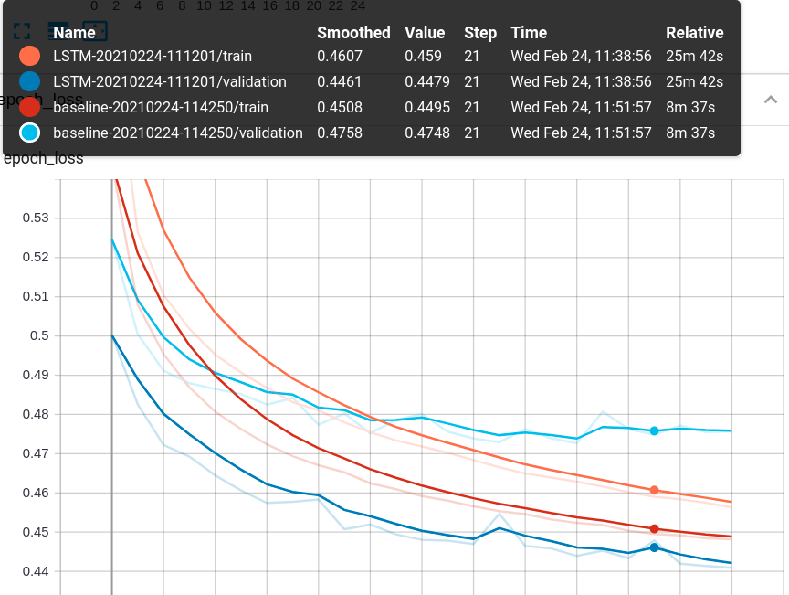
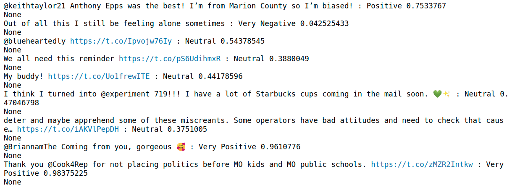

##### *Jung Victor*

---

# Sentiment Analysis Project

## Context

With the rise of social networks and deep learning techniques, sentiment analysis became a must have for a lot of compagny wanted to know the public opinion. First, we will preprocess the dataset, then we will implement two models to evaluate if a tweet is positive or negative, one model will be very simple and act as a baseline to benchmark against a more complex model.

## Our Dataset

We've got 1 600 000 tweets extracted using twitter API labelized as follow :

- 0 : negative
- 4 : positive

For each tweet we've got :

- the id 
- the data
- the username
- the text

This dataset has been created by Go, A., Bhayani, R. and Huang, L,  for Twitter sentiment classification using distant supervision. *CS224N Project Report, Stanford, 1(2009), p.12*.

## Our Approach

### Preprocessing

We first cleaned the dataset by replacing english contractions by full words, for exemple "he's" become "he is". We're also removing english stopwords, twiter username and short word (less than 2 caracters). After that we converted everything in lower case and used the Lancaster Stemmer.

Then we use the pretrained GloVe 100 Model Embedding with max length of 20 and padding with zeros.

### Baseline Model

Below our baseline model summary, we're using a simple layer of 128 Simple RNN units followed by a 64 ReLu Dense layer and a binary Softmax classifier (two labels).

### Our Model

Here we've got 2 layers of LSTM instead of Simple RNN and we added Dropout to avoid overfitting on the data.

 

### Performances

Our LSTM Model is performing better than the baseline model, even if the baseline train loss is close to the LSTM train loss the baseline validation loss isn't following the baseline training loss.

It means our baseline model is overfitting it is maybe due to the lack of Dropout layers.

### The Pipeline

Then we built our pipeline to perform quick predictions and export our model into real world applications. To test the pipeline we are using the twitter API to get few random tweets from the USA and sending it into the pipeline.

Here an exemple of the pipeline :

## Suggested Improvements

We could train more the LSTM model until find the overfit limit to push performances to the maximum, we also could focus more on the preprocessing by converting more abreviations like asap = as soon as possible.

It would also be interesting to try different Stemmer and GloVe embedding to find the best for this project.